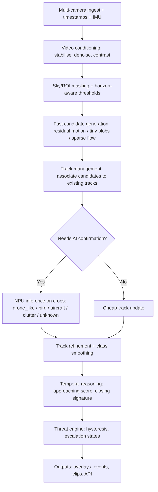

# Early Detection of Airborne Objects on Embedded Compute with Orange Pi 5

<a name="early-detection-of-airborne-objects-on-embedded-compute-with-orange-pi-5"></a>
## Table of Contents
- [Executive summary](#executive-summary)
- [Task and two-part solution as defined in the PDF](#task-and-two-part-solution-as-defined-in-the-pdf)
- [Landscape of existing solutions for the same task](#landscape-of-existing-solutions-for-the-same-task)
  - [Shortlist principles](#shortlist-principles)
  - [Comparative table of top solutions](#comparative-table-of-top-solutions)
  - [Recommendation of the most efficient solution](#recommendation-of-the-most-efficient-solution)
- [Recommended system architecture](#recommended-system-architecture)
  - [Design goals translated into engineering constraints](#design-goals-translated-into-engineering-constraints)
  - [Pipeline flowchart](#pipeline-flowchart)
  - [Concrete “best-of-breed” component mapping](#concrete-best-of-breed-component-mapping)
- [Orange Pi 5 research](#orange-pi-5-research)
  - [What “Orange Pi v5” most plausibly refers to](#what-orange-pi-v5-most-plausibly-refers-to)
  - [Hardware specifications and interfaces](#hardware-specifications-and-interfaces)
  - [Camera interfaces, synchronisation, and practical options](#camera-interfaces-synchronisation-and-practical-options)
  - [OS support and driver reality](#os-support-and-driver-reality)
- [Mapping the recommendation onto Orange Pi 5](#mapping-the-recommendation-onto-orange-pi-5)
  - [High-level implementation blueprint](#high-level-implementation-blueprint)
  - [Exact hardware steps and required accessories](#exact-hardware-steps-and-required-accessories)
  - [Exact software steps for the recommended solution (Orange Pi 5)](#exact-software-steps-for-the-recommended-solution-orange-pi-5)
    - [OS and base system bring-up](#os-and-base-system-bring-up)
    - [Video ingest and hardware decoding](#video-ingest-and-hardware-decoding)
    - [NPU enablement and model deployment](#npu-enablement-and-model-deployment)
    - [Tracking, temporal reasoning, and threat engine](#tracking-temporal-reasoning-and-threat-engine)
  - [Performance expectations on Orange Pi 5](#performance-expectations-on-orange-pi-5)
  - [Estimated costs](#estimated-costs)
  - [Risks and mitigations](#risks-and-mitigations)
  - [Step-by-step implementation plan](#step-by-step-implementation-plan)

## Executive summary

The PDF task is to build an onboard perception system for a ground robotic platform that can **detect small airborne objects early** in real outdoor conditions, then convert detections into **stable tracks, approach indicators, threat scores, and alert events** suitable for an operator UI or autonomy stack. fileciteturn0file0

A consistent result from current anti-UAV literature and benchmarks is that **tiny-object reality** (small pixel footprints, glare, haze, motion, clutter) makes “single-model-on-full-frame” designs brittle and expensive; modern systems instead combine **motion compensation / candidate proposal + lightweight AI + tracking + temporal reasoning**. This aligns closely with both (a) the PDF’s two-part solution and (b) research on detecting flying objects from a moving camera and anti-UAV surveys. fileciteturn0file0 citeturn7search11turn7search25turn16view0

Across open-source options, there is **no single mature, turn-key GitHub repository** that fully implements the PDF’s complete “production-style” pipeline end-to-end for ground robots. Instead, the best practical path is to assemble a **best-of-breed stack** from mature components: benchmarking/data (Anti-UAV), robust detectors/trackers (OpenMMLab, ByteTrack lineage), and **hardware-specific deployment** on the target board (Rockchip RKNN + NPU acceleration). citeturn16view0turn22view0turn23view0turn6search0turn20view0

The most efficient implementation on Orange Pi 5-class hardware is a **two-stage “fast path + heavy path” vision stack**:  
- **Fast path:** IMU-assisted (or vision-estimated) stabilisation → sky/ROI masking → motion-residual candidate extraction → lightweight multi-object tracking and budgeting. fileciteturn0file0  
- **Heavy path:** run AI *only on selected ROIs* using Rockchip’s RKNN toolchain on the NPU, then fuse per-frame predictions into temporally stable track scores and alerts. fileciteturn0file0 citeturn23view3turn20view0turn5view2  

This approach simultaneously optimises **latency, compute, and false-alarm control**, and it maps naturally onto Orange Pi 5’s strengths: Rockchip SoC + NPU acceleration, plus hardware-accelerated decode via Rockchip MPP/GStreamer pipelines. citeturn21view0turn23view3turn8search2turn20view1

## Task and two-part solution as defined in the PDF

The PDF defines a mission that is **not merely object detection**, but early detection of **very small airborne targets** amid outdoor nuisances (clouds, rooftops, trees, glare, dusk/haze, blur, and platform motion), outputting “situational awareness” artefacts: stable tracks, confidence, approach detection, threat scoring, and alert events. fileciteturn0file0

The PDF’s suggested solution is a layered perception architecture: a sensor layer (multi-camera RGB, optional zoom and thermal, IMU), a perception conditioning layer (stabilisation/denoise/contrast), an AI classification stage for airborne-vs-clutter semantics, a tracking layer for persistent multi-object tracks, and a decision layer for approach/threat scoring and hysteresis-based alerts. fileciteturn0file0

Part 2 expands this into a “production-style CV stack” with explicit staging (ingest, conditioning, fast candidate generation, AI on ROIs, tracking, temporal reasoning, threat scoring, and output/control interfaces), plus practical guidance on bounded queues, worker separation, and system metrics. fileciteturn0file0

The strongest “design thesis” in the PDF—shared by much of the modern anti-UAV literature—is that early detection is typically a **tiny-object problem**, so systems should avoid running heavy detectors over full 4K frames continuously; instead they should **narrow search regions cheaply** and apply AI only where needed, then use temporal accumulation and track logic to raise confidence. fileciteturn0file0 citeturn7search25turn16view0turn7search11

## Landscape of existing solutions for the same task

### Shortlist principles

Because the task is end-to-end (capture → conditioning → detection/classification → tracking → temporal approach logic → threat scoring), “solutions” in practice come in three forms:

- **Field-specific benchmarks + baselines** (great for training/evaluation, not always production-ready).
- **General detection + tracking toolchains** (high maturity and community support; need task-specific data/logic).
- **Hardware-specific deployment stacks** (critical for embedded latency and power, but narrower portability).

This section therefore compares candidates that are both (a) highly relevant to anti-UAV / small target detection and (b) realistically deployable, with emphasis on mature open-source projects and established community support. citeturn16view0turn22view0turn22view1turn23view0turn21view0

### Comparative table of top solutions

| Candidate (top 5) | What it is (fit to the PDF task) | Performance & deployment | Community & maturity | Licensing | Key pros | Key cons / gaps |
|---|---|---|---|---|---|---|
| **Rockchip RKNN Model Zoo + RKNN Toolkit2** | Hardware-focused deployment examples for mainstream CV models (incl. YOLO families) on Rockchip NPUs; directly relevant for Orange Pi 5-class boards using RK3588/RK3588S. citeturn23view3turn5view2turn20view0 | Optimised for Rockchip NPU; model conversion on x86/Linux and inference via C/Python runtime on device. citeturn20view0turn5view2turn23view3 | Active, sizeable adoption (thousands of stars); explicitly supports RK3588 class platforms. citeturn23view2turn23view3 | Apache-2.0 (Model Zoo). citeturn23view0 | Best route to embedded efficiency (NPU), reproducible examples, permissive licence. citeturn23view0turn23view3 | Not a complete airborne pipeline; you must add candidate generation, tracking, temporal logic, and your own training data. fileciteturn0file0 |
| **Anti-UAV (CVPR workshop lineage) repo** | A benchmark definition + datasets + baselines for discovering/detecting/tracking UAVs (RGB and IR), including “tiny-scale targets” and dynamic backgrounds—close to the PDF’s problem statement. citeturn16view0 | Typically used for research-grade training/evaluation; production deployment needs engineering work. citeturn16view0 | Strong relative community for this niche (hundreds of stars, many commits), and explicit task definition. citeturn16view0 | MIT. citeturn16view0 | Best public anchor for dataset design, metrics, and baselines aligned to anti-UAV reality; supports RGB+IR scenarios. citeturn16view0 | Baselines are not “robot-ready”; does not directly provide Orange Pi deployment or the PDF’s threat-scoring/alert interfaces. fileciteturn0file0 |
| **OpenMMLab MMDetection + related projects** | A highly mature detection toolbox/benchmark; can train specialised tiny-object detectors and integrate with tracking/deployment frameworks (MMTracking/MMDeploy). citeturn22view0 | Excellent for model R&D when GPUs are available; embedded deployment requires conversion/acceleration work. citeturn22view0turn23view3 | Very large community and contributor base (tens of thousands of stars; hundreds of contributors). citeturn22view0 | Apache-2.0. citeturn22view0 | Deep model variety, strong tooling for training/ablation, well-suited to building “tiny-object” specialists. citeturn22view0 | Not a complete onboard pipeline; heavier stack, steeper learning curve, and you still need the PDF’s real-time staging + threat logic. fileciteturn0file0 |
| **Ultralytics YOLO + Rockchip RKNN export path** | Popular end-to-end YOLO training/inference framework with explicit documentation for exporting to RKNN for Rockchip NPUs. citeturn22view1turn20view0 | Strong developer experience; includes RKNN export guidance (x86-only export). citeturn20view0 | Very large user base (tens of thousands of stars; frequent releases). citeturn22view1 | Default AGPL-3.0 for code and trained models. citeturn6search2turn22view1 | Excellent ergonomics and community; clear RKNN export docs; fast iteration. citeturn22view1turn20view0 | AGPL can be a blocker for many commercial or closed deployments; still needs candidate generation + temporal reasoning to match the PDF’s end-to-end objectives. citeturn6search2turn0search6turn0search30 |
| **Motion-compensated flying-object detection (research baseline)** | Academic approach explicitly targeting flying objects that are small in the field of view, under moving-camera background motion—core to early detection. citeturn7search11turn7search19 | Conceptually efficient for “candidate generation” and motion compensation; not a full deployment system. citeturn7search11turn7search19 | Strong scientific impact (high citation counts) and validates the “motion compensation + detection” paradigm. citeturn7search11turn7search19 | Paper/software licensing varies; often not a maintained production codebase. citeturn7search11turn7search19 | Directly supports the PDF’s staged design: stabilise → residual motion → propose candidates cheaply, then classify/track. fileciteturn0file0 citeturn7search11turn7search19 | Typically not turnkey; you must implement/engineer it (and add classification, tracking lifecycle, threat scoring, UI/API). fileciteturn0file0 |

### Recommendation of the most efficient solution

If “most efficient” means **best end-to-end latency and throughput per watt on embedded compute** while still meeting the PDF’s requirements (multi-object, low latency, robust false-alarm control), the strongest choice is:

**Rockchip RKNN Model Zoo + RKNN Toolkit2 (for NPU inference) combined with the PDF’s staged pipeline design (candidate proposals + tracking + temporal scoring).** citeturn23view3turn5view2turn20view0 fileciteturn0file0

The reasons are pragmatic:

- **Hardware alignment:** RKNN is explicitly designed to exploit Rockchip NPUs (lower latency, higher efficiency) and supports RK3588-class platforms. citeturn20view0turn23view3  
- **Licensing flexibility:** The Model Zoo is Apache-2.0, and the rest of the proposed stack can be assembled from permissive/licence-friendly components (e.g., OpenCV BSD, ByteTrack MIT), avoiding “copyleft surprises” for production. citeturn23view0turn15search0turn6search0  
- **Architectural fit:** Candidate proposals + temporal smoothing (as the PDF stresses) are exactly what reduces compute load when targets are tiny and false positives are prevalent. fileciteturn0file0  

Ultralytics YOLO is highly productive and can export to RKNN, but its default AGPL licensing is a major strategic constraint for many deployments. citeturn22view1turn6search2turn20view0

## Recommended system architecture

### Design goals translated into engineering constraints

From the PDF’s staged pipeline, the key constraints that the implementation must satisfy are:

- **Low and bounded latency**: avoid unbounded queues and ensure “frame age” is monitored; prioritise confirmed/approaching tracks. fileciteturn0file0  
- **High recall early, then increase precision temporally**: accept noisy early detections, but demand temporal persistence and converging motion for alerts. fileciteturn0file0  
- **Compute separation**: “fast path” operations must be predictable; “heavy path” inference must be scheduled/budgeted. fileciteturn0file0  
- **Robust false alarm controls** specifically targeting birds/glare/background edges using temporal behaviour and region masking. fileciteturn0file0  

These design choices are consistent with anti-UAV benchmark task definitions and broader anti-UAV survey conclusions about multi-stage detection and tracking. citeturn16view0turn7search25turn7search14

### Pipeline flowchart



This is effectively the PDF’s Stage 0–7 design expressed as an executable mental model, with the key optimisation that AI runs only on **selected ROIs** rather than full frames. fileciteturn0file0

<a name="concrete-best-of-breed-component-mapping"></a>
### Concrete “best-of-breed” component mapping

- **Ingest / decode:** GStreamer pipelines with Rockchip hardware-accelerated decode via MPP plugins (e.g., `mppvideodec`) and RTSP ingest patterns, matching Rockchip’s own GStreamer guide. citeturn21view0  
- **Conditioning / masking / motion residual:** OpenCV-based (or equivalent) stabilisation and residual computation; motion compensation for moving-camera scenarios is a validated approach in “flying object detection from a moving camera” research. citeturn7search11turn7search19turn15search0  
- **Inference on ROIs:** RKNN runtime on the NPU using the RKNN Model Zoo patterns; convert and quantise models with RKNN Toolkit2 on an x86 Linux machine. citeturn23view3turn20view0turn5view2  
- **Tracking:** A detection-to-track association method like ByteTrack (MIT) is a strong default choice where ID stability and multi-object tracking matter. citeturn6search0turn6search4  
- **Robot integration:** Where the broader system is ROS-based, ROS 2’s Apache-2.0 licensing and packaging ecosystem are generally compatible with embedded deployments. citeturn15search2turn15search6  

## Orange Pi 5 research

### What “Orange Pi v5” most plausibly refers to

In current community and vendor documentation, “v5” most commonly maps to the **Orange Pi 5** family (and nearby variants like 5B/5 Plus/5 Pro/5 Max). The baseline Orange Pi 5 board is built around Rockchip’s RK3588S and is widely used as a low-cost NPU-equipped SBC. citeturn18search11turn20view1turn4search30

### Hardware specifications and interfaces

Orange Pi 5 uses the RK3588S and provides an 8-core CPU configuration (Cortex-A76 + Cortex-A55) with a Mali GPU and an NPU commonly described as “6 TOPS” in vendor materials. citeturn20view1turn18search11

The official Orange Pi wiki summary for the Orange Pi 5 highlights the “brought out” interfaces: HDMI output, USB-C, M.2 (PCIe2.0 x1), Gigabit Ethernet, USB 2.0/USB 3.0, and a 26-pin header. citeturn4search30turn4search17

Power is specified as **USB-C Type-C power supply, 5V @ 4A**, and the vendor interface listing also references a 5V fan header and a 3-pin debug serial port (UART). citeturn8search2turn8search7turn8search15

A key system-level limitation that matters for compute pipelines is the Orange Pi 5’s NVMe interface: multiple community and test sources note that the M.2 slot is effectively **PCIe 2.0 x1**, implying a theoretical ~500 MB/s ceiling, with real-world throughput potentially lower. citeturn8search14turn8search0turn8search10

Wireless support varies by board variant. Multiple community sources (including long-form board reviews and user threads) emphasise that the baseline Orange Pi 5 is often shipped **without built-in Wi‑Fi/Bluetooth**, requiring either USB dongles or sacrificing the single M.2 slot via an adapter for a Wi‑Fi module. citeturn14search23turn14search3turn14search7

image_group{"layout":"carousel","aspect_ratio":"16:9","query":["Orange Pi 5 board photo","Orange Pi 5 RK3588S single board computer","Orange Pi 5 M.2 PCIe slot","Orange Pi 5 GPIO 26 pin header"]}

### Camera interfaces, synchronisation, and practical options

For this task, camera connectivity is a first-order design choice. A pragmatic path is to use **USB UVC cameras** or RTSP-capable cameras and rely on hardware decode (H.264/H.265) to keep CPU load manageable; Rockchip’s GStreamer documentation explicitly describes RTSP→H.264 depayload→parse→`mppvideodec` pipelines. citeturn21view0

If you need MIPI CSI cameras for tighter integration and latency, there are ecosystem adapter boards intended to connect standard Raspberry Pi camera modules to the Orange Pi 5 series. One example states support for **4-lane MIPI CSI-2** (up to 1.5 Gbps per lane) and is explicitly sold for Orange Pi 5 series boards. citeturn19view0

### OS support and driver reality

On OS support, entity["organization","Armbian","linux distribution project"] provides maintained images for Orange Pi 5, including a vendor/BSP-based kernel line (v6.1) described as “works stable” and a mainline-based kernel line (v6.18) described as “most stable mainline based kernel but not all features have been implemented yet.” citeturn20view2

The Armbian board page also documents common bring-up issues and mitigations, including guidance that if the board will not boot from SD you may need to erase SPI bootloader remnants from the stock OS, and it reports a test configuration where Gigabit Ethernet throughput is ~940 Mbit/s and 4K video playback in Chromium is accelerated. citeturn20view2

For AI acceleration on Rockchip, the NPU driver/runtime versioning is a known friction point across RK3588 boards. Multiple vendor/community documents show the conventional way to check the NPU driver via:

`cat /sys/kernel/debug/rknpu/version`

and show example output like “RKNPU driver: v0.9.8”, often used as a minimum requirement for newer NPU runtime workloads. citeturn14search2turn14search10turn14search18

## Mapping the recommendation onto Orange Pi 5

### High-level implementation blueprint

The recommended implementation is an Orange Pi 5 deployment of the PDF’s architecture with Rockchip-optimised execution:

- Use Rockchip MPP/GStreamer for decoding (minimise CPU and allow multi-stream ingest). citeturn21view0  
- Implement candidate generation and tracking on CPU (predictable “fast path”). fileciteturn0file0  
- Run ROI inference on the NPU via RKNN (bounded “heavy path”). citeturn23view3turn5view2  
- Fuse decisions temporally (approach/threat scoring + hysteresis). fileciteturn0file0  

### Exact hardware steps and required accessories

A realistic hardware BOM depends on whether you prioritise “panoramic coverage” or “long-range confirmation,” but the PDF implies at least 2 wide-FOV cameras, optional zoom, and an IMU. fileciteturn0file0

**Core compute**
- Orange Pi 5 (8GB RAM class is a reasonable baseline for multi-camera buffering + CV; higher RAM helps if you do tiled inference or run more cameras). The official distributor listing gives the 8GB board price and summary spec (RK3588S, Mali-G610, “6 TOPS NPU,” HDMI 2.1, M.2 PCIe2.0, Gigabit LAN). citeturn20view1  
- USB-C power supply capable of 5V/4A (vendor ecosystem provides a 5V/4A Type-C supply and lists similar power requirements on Orange Pi 5 pages). citeturn8search2turn8search15turn8search7  
- Cooling: at minimum a heatsink; active cooling is recommended for sustained high-load CV, as multiple reviews show thermal throttling behaviour and measurable temperature reductions with board-specific coolers. citeturn8search13turn8search21turn8search5  

**Storage**
- NVMe SSD in the M.2 slot for stable logging/ring buffers and faster writes than microSD, with the explicit caveat that Orange Pi 5’s M.2 is widely reported as PCIe 2.0 x1 (~500 MB/s theoretical). citeturn8search14turn8search0turn8search10  

**Sensors**
- Cameras: either (a) USB cameras, or (b) RTSP-capable cameras streaming H.264/H.265, which you decode with `mppvideodec`. citeturn21view0  
- Optional CSI camera integration via adapter boards supporting Raspberry Pi camera modules on the Orange Pi 5 series, if you need CSI latency/quality and are prepared for the Linux camera stack effort. citeturn19view0  
- IMU on I²C/SPI: choose a board-supported module and validate device-tree overlays; community testing notes Orange Pi overlay work is sometimes manual, even when drivers exist. citeturn4search12  

**Connectivity**
- Prefer wired Gigabit Ethernet for reliability; Armbian test reporting indicates ~940 Mbit/s throughput. citeturn20view2  
- If you need Wi‑Fi/Bluetooth on the baseline Orange Pi 5, plan for USB dongles or an M.2 adapter strategy (which competes with NVMe usage), and expect driver/firmware fiddling in some OS builds. citeturn14search23turn14search3turn14search7turn14search11  

<a name="exact-software-steps-for-the-recommended-solution-orange-pi-5"></a>
### Exact software steps for the recommended solution (Orange Pi 5)

<a name="os-and-base-system-bring-up"></a>
#### OS and base system bring-up

1) Install an OS with good Rockchip BSP support first (for VPU/NPU practicality). The Armbian Orange Pi 5 page provides both vendor/BSP (v6.1) and mainline-based (v6.18) images and flags that mainline may lack features. citeturn20view2  

2) If the board does not boot from SD, follow the documented mitigation: erase the SPI bootloader remnants from the stock OS. citeturn20view2  

3) Update and install baseline packages (compiler toolchain, Python, GStreamer, OpenCV). OpenCV licensing context is BSD-3-Clause for historical versions, and you should check the exact version in your distro, but OpenCV is widely licensed permissively. citeturn15search0  

<a name="video-ingest-and-hardware-decoding"></a>
#### Video ingest and hardware decoding

4) Use GStreamer for camera ingest and prefer hardware decode via Rockchip MPP. Rockchip’s GStreamer user guide describes the MPP plugins (e.g., `mppvideodec`) and provides RTSP/H.264 examples. citeturn21view0  

A representative pattern for RTSP H.264 streams (adapt to your camera URL, latency settings, and downstream sink) is:

```bash
gst-launch-1.0 rtspsrc location=rtsp://<camera>/stream latency=50 ! \
  rtph264depay ! h264parse ! mppvideodec ! videoconvert ! appsink
```

This aligns with the documented example pipeline chain (RTSP depay → parse → `mppvideodec`). citeturn21view0

<a name="npu-enablement-and-model-deployment"></a>
#### NPU enablement and model deployment

5) Confirm the NPU driver is present and at an acceptable version:

```bash
sudo cat /sys/kernel/debug/rknpu/version
```

Example outputs like `RKNPU driver: v0.9.8` are shown across RK3588 board documentation and are commonly referenced as a baseline for newer runtimes. citeturn14search2turn14search10turn14search18  

6) Adopt RKNN Model Zoo patterns for inference and examples. It explicitly supports RK3588-class platforms and is designed around converting models with RKNN Toolkit2 and running inference via Python/C APIs. citeturn23view3  

7) Convert your trained model to RKNN on an **x86 Linux PC** (not on the ARM board). This constraint is explicitly stated in the Rockchip RKNN export guidance. citeturn20view0  

8) Choose a model strategy consistent with the PDF:

- **MVP strategy:** candidate generation → crop classifier / micro-detector. fileciteturn0file0  
- **Later strategy:** tile-based detector only for high-risk regions/tracks. fileciteturn0file0  

Practically, you can start with a small YOLO-family detector exported to RKNN, then refactor to a crop-classifier if full detection is too expensive or too noisy. The RKNN Model Zoo states it includes deployment examples for mainstream algorithms and includes YOLO families among supported demos. citeturn23view3  

9) If using entity["company","Ultralytics","yolo developer"] for training, be explicit about licensing and export: Ultralytics states its default licence is AGPL-3.0 and provides the RKNN export guide, but the AGPL requirement can be incompatible with many closed deployments. citeturn6search2turn22view1turn20view0  

<a name="tracking-temporal-reasoning-and-threat-engine"></a>
#### Tracking, temporal reasoning, and threat engine

10) Implement a multi-object tracker with lifecycle management (tentative/confirmed/lost), short-gap tolerance, and confidence smoothing, as the PDF describes. fileciteturn0file0  

ByteTrack is a strong default for tracking-by-detection and is MIT licensed. citeturn6search0turn6search4

11) Implement approach detection (closing behaviour) as a **temporal feature model** (rule-based first; learned later), as recommended in the PDF. fileciteturn0file0  

12) Implement threat scoring with hysteresis and multi-target escalation states, and emit structured events plus ring-buffered pre/post clips. fileciteturn0file0  

### Performance expectations on Orange Pi 5

A useful anchor for worst-case inference cost is NPU throughput on RK3588-class devices. The Qengineering NPU benchmark table reports **YOLOv8n ~53 FPS on RK3588** (INT8 quantised) in a C++ example context. citeturn5view1  

In the recommended architecture, you should avoid full-frame YOLO on every camera frame. Instead:

- Candidate generation is cheap and bounded; you then run inference on a limited set of ROIs per frame. fileciteturn0file0  
- If you constrain ROI count (e.g., budget to N ROIs per camera per second), your NPU load scales with candidate rate rather than frame size. fileciteturn0file0  

A realistic expectation is that you can sustain multi-camera operation at usable latency if you (a) rely on hardware decode, and (b) keep AI calls bounded by ROI budgeting—exactly the “fast path / heavy path” principle the PDF emphasises. citeturn21view0turn5view1 fileciteturn0file0  

### Estimated costs

Costs vary dramatically by region, camera choice, and whether you use CSI adapters. The following is a defensible baseline estimate anchored in cited vendor listings where available (USD, March 2026 context).

| Item | Qty | Approx unit cost | Subtotal | Notes |
|---|---:|---:|---:|---|
| Orange Pi 5 (8GB) | 1 | $140 | $140 | Official distributor listing. citeturn20view1 |
| 5V/4A USB-C power adaptor | 1 | $10.90 | $10.90 | Vendor listing. citeturn20view1turn8search15 |
| Active cooler / heatsink+fan | 1 | ~$13–$20 | ~$13–$20 | Example: Orange Pi 5 dedicated ICE Tower cooler pricing reported around $19.99 (or ~$12.69 + shipping). citeturn8search21 |
| NVMe SSD (capacity as required) | 1 | (market) | (market) | Bandwidth limited by PCIe 2.0 x1 on Orange Pi 5. citeturn8search14turn8search0 |
| Cameras (USB or RTSP) | 2–4 | (market) | (market) | Choose based on resolution/FOV and RTSP encoding support. citeturn21view0 |
| Optional CSI camera adapter | per CSI cam | $15 | $15 each | CSI adapter board & cable listing. citeturn19view0 |
| IMU module | 1 | (market) | (market) | I²C/SPI module; validate overlays/drivers. citeturn4search12 |

The “most predictable” costs are the board, the 5V/4A supply, and the CSI adapter board/specific cooler examples; camera and SSD pricing should be selected based on availability and environmental constraints. citeturn20view1turn8search21turn19view0

### Risks and mitigations

| Risk | Why it matters for early airborne detection | Mitigation strategy | Residual risk |
|---|---|---|---|
| False positives from birds, glare, skyline edges | Known dominant failure mode in airborne tiny-target detection; single-frame classification is unreliable. fileciteturn0file0 | Enforce temporal persistence + class smoothing + “approach signature” features; harvest hard negatives; zone-aware masking near horizon/trees/buildings. fileciteturn0file0 | Moderate (environment-dependent). |
| Compute overload and rising latency under clutter | Candidate explosion can saturate inference and break early warning. fileciteturn0file0 | Bounded queues, ROI prioritisation, max AI budget per frame, degrade policy; rely on hardware decode to free CPU headroom. fileciteturn0file0 citeturn21view0 | Low–moderate if engineering discipline is maintained. |
| NPU driver/runtime mismatch | RKNN stacks are version-sensitive; missing or outdated rknpu prevents acceleration. citeturn14search2turn5view2turn14search18 | Choose a BSP-backed OS first; verify `/sys/kernel/debug/rknpu/version`; pin known-good RKNN toolkit/runtime versions. citeturn20view2turn14search2turn23view3turn5view2 | Moderate (board/OS variance). |
| Thermal throttling under sustained load | Embedded CV loads are continuous; throttling raises latency and reduces detection range. citeturn8search13turn8search21turn8search5 | Use heatsink + active cooling; design enclosure airflow; monitor temps and apply CPU/NPU scheduling limits. citeturn8search21turn8search5 | Low if cooled; higher in sealed enclosures. |
| Storage/IO bottlenecks (NVMe bandwidth limits) | Event clips + telemetry can be write-heavy; poor IO causes dropped frames. fileciteturn0file0 | Use NVMe but account for PCIe 2.0 x1 limit; keep event storage bounded; prefer sequential writes; avoid writing raw full-res streams continuously. citeturn8search14turn8search0turn8search10 | Low if designed for it. |
| Wi‑Fi/BT driver issues on some OS builds | Impacts field operations, updates, and telemetry. citeturn14search11turn14search3turn14search23 | Prefer wired Ethernet; if wireless is required, select well-supported chipsets and ensure firmware packages are installed; test on your chosen OS early. citeturn14search7turn20view2turn14search11 | Moderate for USB dongles; lower for Ethernet. |

### Step-by-step implementation plan

The plan below is structured to minimise rework by validating “fast-path” system constraints (latency, decode, synchronisation) before expensive model work—mirroring the PDF’s emphasis on predictive processing and metrics. fileciteturn0file0

1) **Bring-up and profiling baseline**
   - Install Armbian (prefer vendor/BSP kernel v6.1 first for stability), apply bootloader mitigation if needed, and validate Ethernet throughput and camera ingest. citeturn20view2  
   - Establish metrics logging: input FPS, dropped frames, queue depth, frame age (end-to-end latency). fileciteturn0file0  

2) **Hardware decode validation (must-have for multi-stream)**
   - Stand up RTSP/H.264 ingest per camera; confirm `mppvideodec` works and CPU stays low. citeturn21view0  

3) **MVP “fast candidate generation”**
   - Implement stabilisation (IMU-assisted if available; otherwise global motion estimation), and motion-residual candidate extraction + ROI masking. fileciteturn0file0 citeturn7search11turn7search19  

4) **Tracker integration**
   - Implement multi-object track manager (IDs, lifecycle, short-gap tolerance, history). fileciteturn0file0  
   - Start with a tracker approach compatible with ByteTrack-like association and tune gating/thresholds for tiny targets. citeturn6search4turn6search0  

5) **AI ROI inference on the NPU**
   - Verify rknpu version; set up RKNN runtime tooling on-device. citeturn14search2turn14search18turn23view3  
   - Convert your chosen model to RKNN on x86 Linux, per RKNN export guidance. citeturn20view0turn5view2  
   - Integrate ROI inference and calibrate “airborne vs clutter” first (high recall), then multi-class (drone_like / bird / aircraft). fileciteturn0file0  

6) **Temporal approach and threat scoring**
   - Implement rule-based approach scoring (size growth, bearing stability, radial alignment), then threat score with hysteresis and multi-target escalation states. fileciteturn0file0  

7) **Outputs, observability, and iteration loop**
   - Build overlays and event recording with a ring buffer; export structured events to the autonomy/UI layer. fileciteturn0file0  
   - Collect in-the-wild data and hard negatives aligned to Anti-UAV benchmark guidance and the PDF’s failure mode list, then iterate thresholds and model training. fileciteturn0file0 citeturn16view0turn7search25